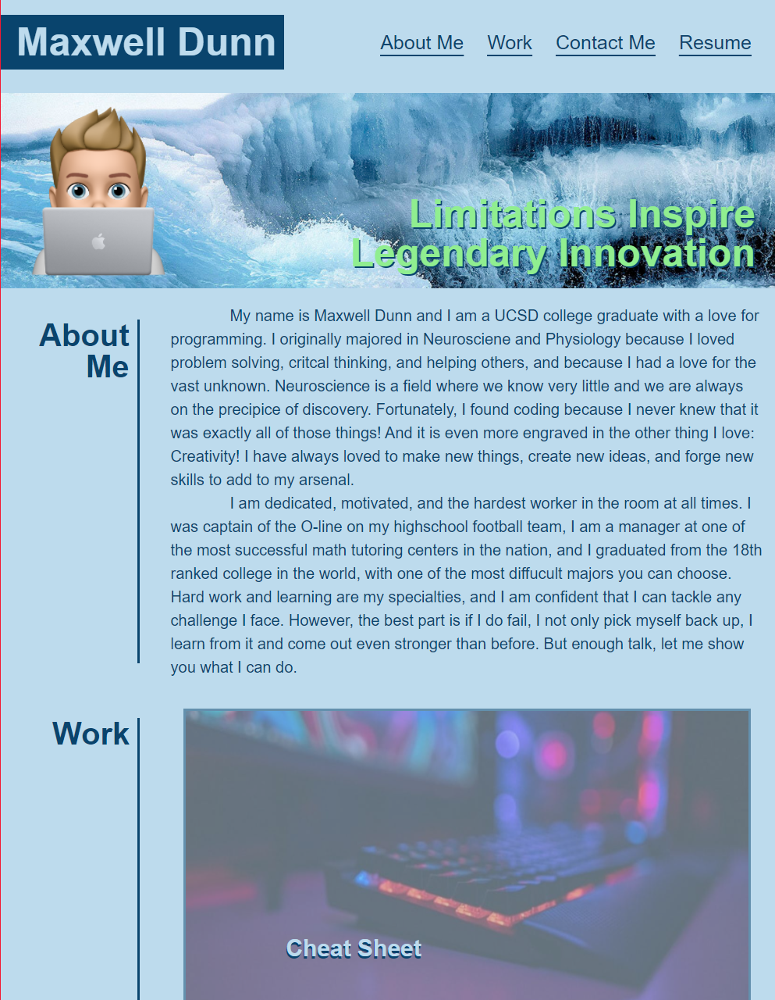

# my-portfolio
The hub for my programming work and self promotion.
https://maxd66.github.io/my-portfolio/

## Description

This portfolio is a dynamic website, built for all different devices. This page is meant to tell the user a little bit about myself, and display some of my programming work. All the needed contact information should be provided if you wish to get in touch with me! 

## Installation and Usage

There is no installation required.

## Credits

I worked on the html and css on my own.

The bitcoin image cam from: https://www.flickr.com/photos/jason_benjamin/8632995866

The question marks picture came from: https://www.system-concepts.com/insights/global-accessibility-awareness-day-2019/question-marks-multicoloured-banner/

Weather picture came from: https://www.ncyc.net.au/sailing-academy/weather-course/module-1/watch-the-weather-image1-hero/

## License

The website was insired by a mockup provided by UCSD Coding Bootcamp Extension.

